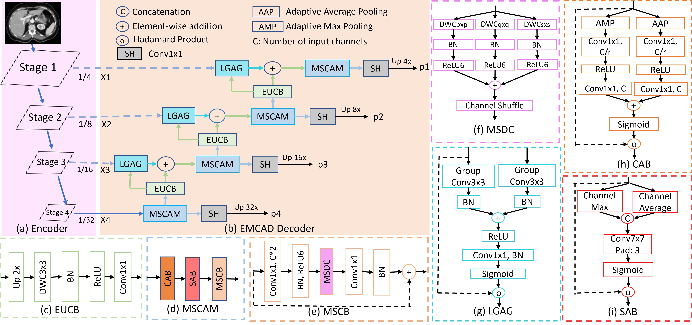
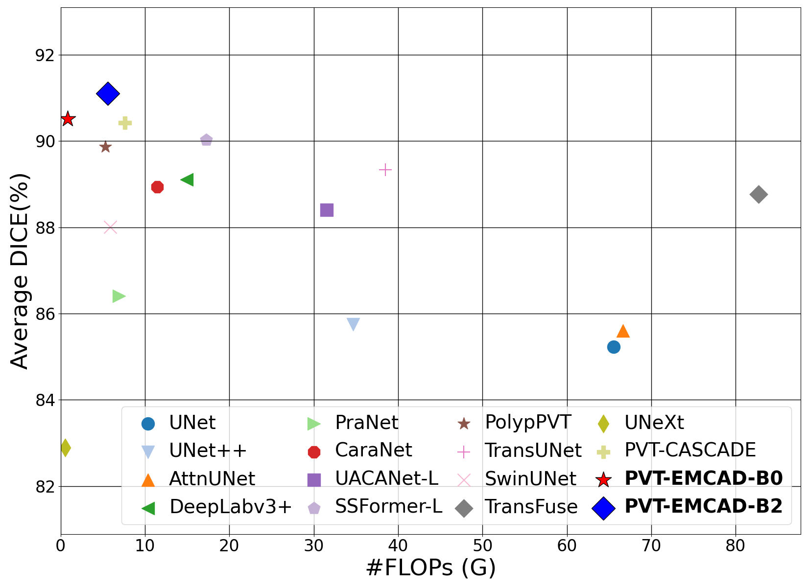
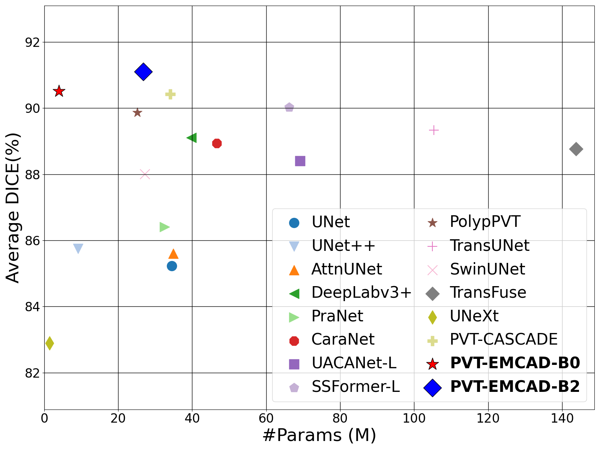
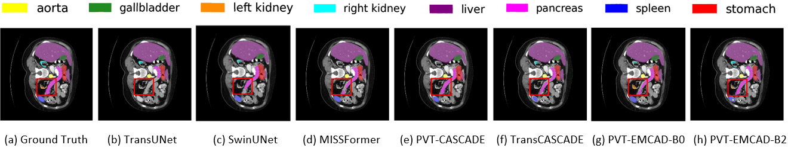

# EMCAD

Official Pytorch implementation of the paper [EMCAD: Efficient Multi-scale Convolutional Attention Decoding for Medical Image Segmentation](https://cvpr.thecvf.com/virtual/2024/poster/30814) published in CVPR 2024.  [arxiv](https://arxiv.org/abs/2405.06880) [code](https://github.com/SLDGroup/EMCAD/) [video](https://youtu.be/cFLWj6ystzw)
<br>
[Md Mostafijur Rahman](https://github.com/mostafij-rahman), [Mustafa Munir](https://github.com/mmunir127), [Radu Marculescu](https://radum.ece.utexas.edu/)
<p>The University of Texas at Austin</p>

## Update
**Synapse training code released!!!**

## Architecture

<p align="center">

</p>

## Quantitative Results

<p align="center">


</p>

## Qualitative Results

<p align="center">

</p>

<p align="center">

</p>

## Usage:
### Recommended environment:
**Please run the following commands.**
```
conda create -n emcadenv python=3.8
conda activate emcadenv

pip install torch==1.11.0+cu113 torchvision==0.12.0+cu113 torchaudio==0.11.0 --extra-index-url https://download.pytorch.org/whl/cu113

pip install mmcv-full -f https://download.openmmlab.com/mmcv/dist/cu113/torch1.11.0/index.html

pip install -r requirements.txt

```

### Data preparation:
- **Synapse Multi-organ dataset:**
Sign up in the [official Synapse website](https://www.synapse.org/#!Synapse:syn3193805/wiki/89480) and download the dataset. Then split the 'RawData' folder into 'TrainSet' (18 scans) and 'TestSet' (12 scans) following the [TransUNet's](https://github.com/Beckschen/TransUNet/blob/main/datasets/README.md) lists and put in the './data/synapse/Abdomen/RawData/' folder. Finally, preprocess using ```python ./utils/preprocess_synapse_data.py``` or download the [preprocessed data](https://drive.google.com/file/d/1tGqMx-E4QZpSg2HQbVq5W3KSTHSG0hjK/view?usp=share_link) and save in the './data/synapse/' folder. 
Note: If you use the preprocessed data from [TransUNet](https://drive.google.com/drive/folders/1ACJEoTp-uqfFJ73qS3eUObQh52nGuzCd), please make necessary changes (i.e., remove the code segment (line# 88-94) to convert groundtruth labels from 14 to 9 classes) in the utils/dataset_synapse.py. 

- **ACDC dataset:**
Download the preprocessed ACDC dataset from [Google Drive of MT-UNet](https://drive.google.com/file/d/13qYHNIWTIBzwyFgScORL2RFd002vrPF2/view) and move into './data/ACDC/' folder.

### Pretrained model:
You should download the pretrained PVTv2 model from [Google Drive](https://drive.google.com/drive/folders/1Eu8v9vMRvt-dyCH0XSV2i77lAd62nPXV?usp=sharing)/[PVT GitHub](https://github.com/whai362/PVT/releases/tag/v2), and then put it in the './pretrained_pth/pvt/' folder for initialization.

### Training:
```
cd into EMCAD
python -W ignore train_synapse.py --root_path /path/to/train/data --volume_path path/to/test/data --encoder pvt_v2_b2         # replace --root_path and --volume_path with your actual path to data.

```

### Testing:
```
cd into EMCAD 
```

## Acknowledgement
We are very grateful for these excellent works [timm](https://github.com/huggingface/pytorch-image-models), [CASCADE](https://github.com/SLDGroup/CASCADE), [MERIT](https://github.com/SLDGroup/MERIT), [G-CASCADE](https://github.com/SLDGroup/G-CASCADE), [PraNet](https://github.com/DengPingFan/PraNet), [Polyp-PVT](https://github.com/DengPingFan/Polyp-PVT) and [TransUNet](https://github.com/Beckschen/TransUNet), which have provided the basis for our framework.

## Citations

``` 
@inproceedings{rahman2024emcad,
  title={Emcad: Efficient multi-scale convolutional attention decoding for medical image segmentation},
  author={Rahman, Md Mostafijur and Munir, Mustafa and Marculescu, Radu},
  booktitle={Proceedings of the IEEE/CVF Conference on Computer Vision and Pattern Recognition},
  pages={11769--11779},
  year={2024}
}
```
